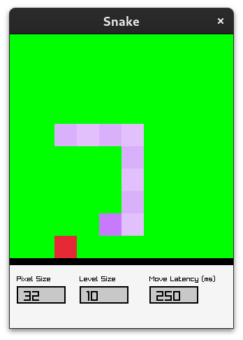

# Snake
The game snake, but you can change the game settings while playing.



## Controls
* Moving - WASD / Arrow Keys

## Settings
* Hover over the field you want to change (Pixel Size, Game World Size, or Latency (milliseconds)) and type.
* Press Enter to apply all changes, C to clear changes or R to reset to game defaults.

## Building
[Linux](https://github.com/raysan5/raylib/wiki/Working-on-GNU-Linux)
```zsh
make && ./game.c
```
* You can build for other platforms following: https://github.com/raysan5/raylib?tab=readme-ov-file